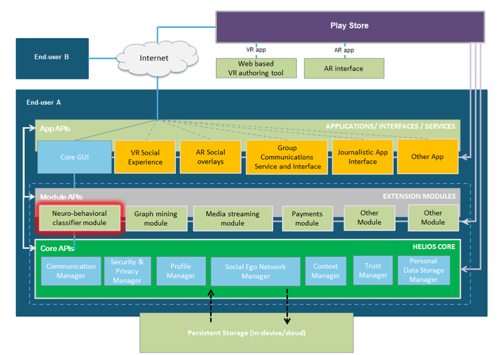
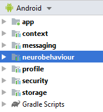
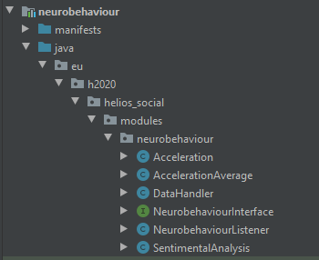
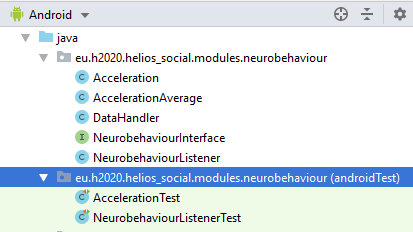
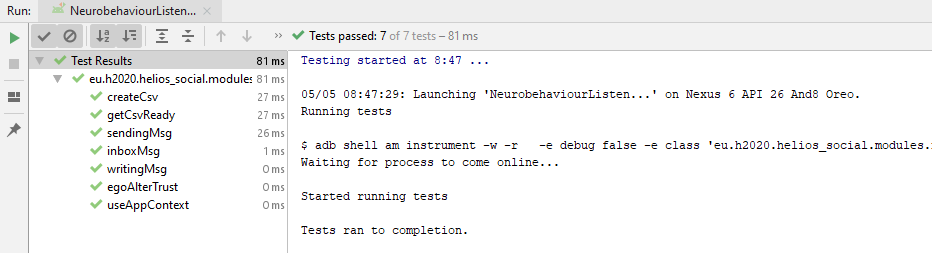
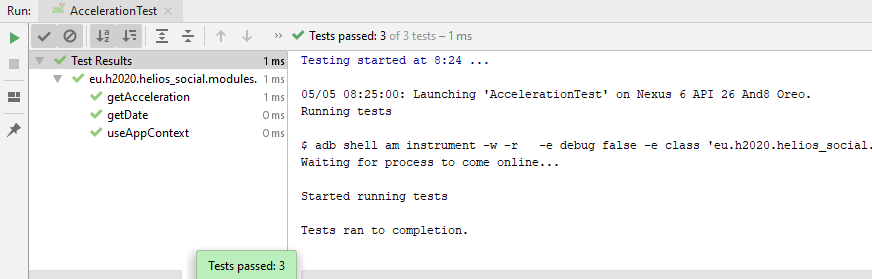

<h1>Neurobehavioral classifier module</h1>

A set of algorithms implemented as an extension module to analyse the <b>emotional statements</b> of the users with two main aims:

<ul>
    <li>Determine an <b>emotional score</b> between an ego and an alter, giving this info to feed the <b>trust model</b>.</li>
    <li>Analyse the content shared creating metrics to give feedback on how the users response to a specific stimulus.</li>
</ul>
<h3>Module with the following functionalities:</h3>
<ul>
    <li>Interface to communicate with Neurobehavioral classifier module</li>
    <li>Metrics of accelerometer sensor for each event in chat activity</li>
    <li>Sentiment analysis of each image sent through Helios chat</li>
	<li>Sentiment analysis of Helios chat texts</li>
	<li>Storage system for metrics of the module</li>
</ul>

<b>HELIOS Neuro-behavioral classifier module</b> is one of the HELIOS Module APIs as highlighted in the picture below:

<h2>Cloning repository</h2>

git clone https://scm.atosresearch.eu/ari/helios_group/neurobehaviouralclassifier.git

<h2> </h2>
<h2>Neurobehaviour module</h2>

Current version of Neurobehaviour module works with TestClient app (app + modules) with the purpose of integrate callings to Neurobehaviour module when the user interacts with Helios chat.

  

 

Please follow the next steps to integrate Neurobehaviour module into your app.

<h2> </h2>
<h2>Integration of the module in the app</h2>

Open your app in Android Studio.

<b>File > New > Import Module</b>

Go to <i>neurobehaviouralclassifier</i> folder. Select <b>neurobehaviour</b> folder like source directory. Click <b>Finish</b> to import.

New module should appears in first line of <b>settings.gradle</b> file:

<code>include ':app', ':storage', ':messaging', ':profile', ':security', ':context', <b>':neurobehaviour'</b></code>

  Open <b>build.gradle</b> file of app module. In <b>dependencies</b> section add:

<code>implementation project(":neurobehaviour")</code>

  

In order to test all features of Neurobehavioral module, you will need to modify some files in TestClient app folder. Please follow <a href="doc/testclient-files.md" title="testclient app files">these steps</a>.

<h2> </h2>
<h1>Neurobehaviour module inputs</h1>

<b>Helios app should activate Neurobehavioral module with this events and its correspondent calling:</b>

    

We will use the same calling for all type of message (text / audio / image)

<ul>
    <li>User starts to write a message -> calling to <b>writingMsg</b> function</li>
	<li>User sends the written message -> <b>sendingMsg</b> function</li>
</ul><ul>
    <li>User receives a message -> calling to <b>inboxMsg</b> function</li>
    <li>User starts to read a message -> <b>readingChat</b> function</li>
	<li>User closes the chat after reading -> <b>chatClosed</b> function</li>
</ul><ul>
    <li>Updating Ego - Alter Trust value -> calling to <b>egoAlterTrust</b> function</li>
</ul>

<h2> </h2>
<h1>Neurobehaviour module outputs</h1>

<h3>Ego - Alter sentimental analysis</h3>

<b>Neurobehaviour module > Trust Manager</b>

Neurobehaviour module extracts metrics from user behaviour:

<ul>
	<li>Attention</li>
	<li>Arousal</li>
	<li>Valence</li>
	<li>Personality</li>
</ul>

Calling to <b>egoAlterTrust</b> function

When Trust module make the call, Neurobehaviour module sends this metrics to calculate the <b>new Trust value</b>.

<h3>Sensors analysis</h3>

After user has sent or read a message, Neurobehaviour module sends sensor metrics (acceleration average) using <b>SensorValueListener</b> interface (Context module)

<b>DataHandler.java</b>

<code>
	//Using Context module interface to send acceleration value
	import eu.h2020.helios_social.core.sensor.ext.DeviceSensor;
</code>
<code>
	obj.msgId = msgId;
	obj.accelAverage = averageAccel;
	deviceSensor.receiveValue(obj);
</code>

<h2> </h2>
<h1>Using the module</h1>

How we can call module functions from other modules through methods of the listener:

<ul>
	<li><a href="doc/contents-analysis.md" title="Contents analysis">Contents analysis: Text, image and speech analysis</a></li>
	<li><a href="doc/ego-alter-analysis.md" title="Ego - Alter analysis">Ego - Alter analysis</a></li>
</ul>

<h2> </h2>
<h1>Module structure - Java classes</h1>

Module view in Android Studio

	

	

<ul>
	<li><a href="doc/classes-interface.md" title="Neurobehaviour interface class">Neurobehaviour Interface Class</a></li>
	<li><a href="doc/classes-listener.md" title="Neurobehaviour listener class">Neurobehaviour module listener Class</a></li>
    <li><a href="doc/classes-datahandler.md" title="Datahandler Class">DataHandler Class</a></li>
    <li><a href="doc/classes-acceleration.md" title="Acceleration class">Acceleration Class</a></li>
    <li><a href="doc/classes-average.md" title="Acceleration average class">Acceleration average Class</a></li>
    <li><a href="doc/classes-imageanalysis.md" title="Image analysis class">Sentiment analysis Class</a></li>
</ul>

    
<h2> </h2>
<h2>Testing the module</h2>

Unit tests carried out using <b>JUnit4 framework</b> testing library

Instrumented unit tests for Neurobehaviour module in:

 

Info about Android instrumented unit tests:

<a href="https://developer.android.com/training/testing/unit-testing/instrumented-unit-tests" target="_blank" title="Andriod instrumented unit tests">https://developer.android.com/training/testing/unit-testing/instrumented-unit-tests</a>

<h3>Results of conducted tests</h3>

Results of unit tests for NeurobehaviourListener class:

 

Results of unit tests for Acceleration class:

    
<h2> </h2>
<h2>Running the module</h2>

<b>Logcat tags to debug the module</b>

<ul>
	<li>v/listen > show info about listener callbacks</li>
	<li>v/thread > acceleration measurement values (real time linear acceleration and average)</li>
    <li>v/cv > functions for Computer Vision and results of image sentimental analysis</li>
	<li>v/text > results of text sentimental analysis</li>
    <li>v/storage > it shows info about module storage system operations</li>
    <li>v/lab > functions for sessions of Neurobehavioural module validation</li>
</ul>

